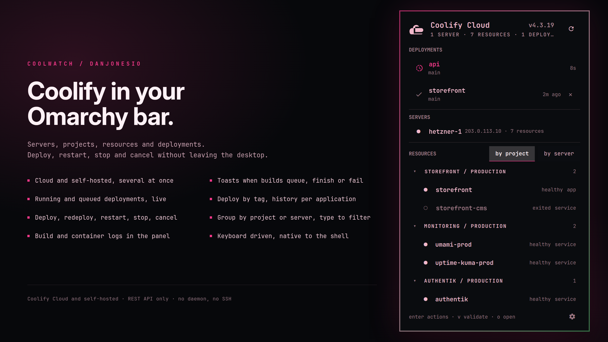
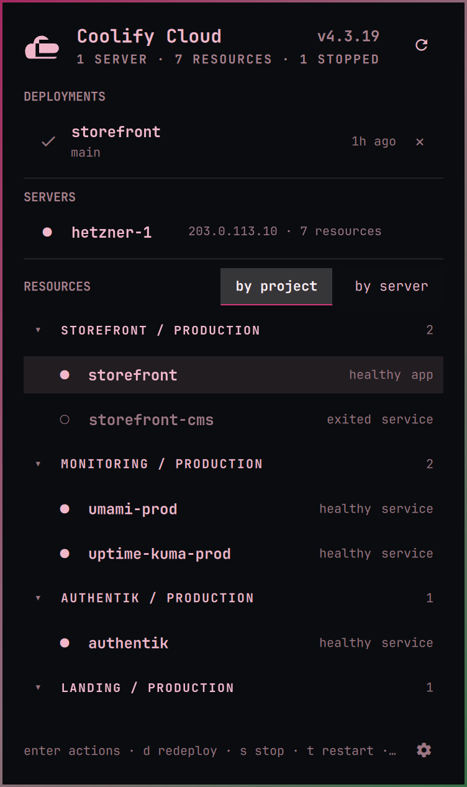
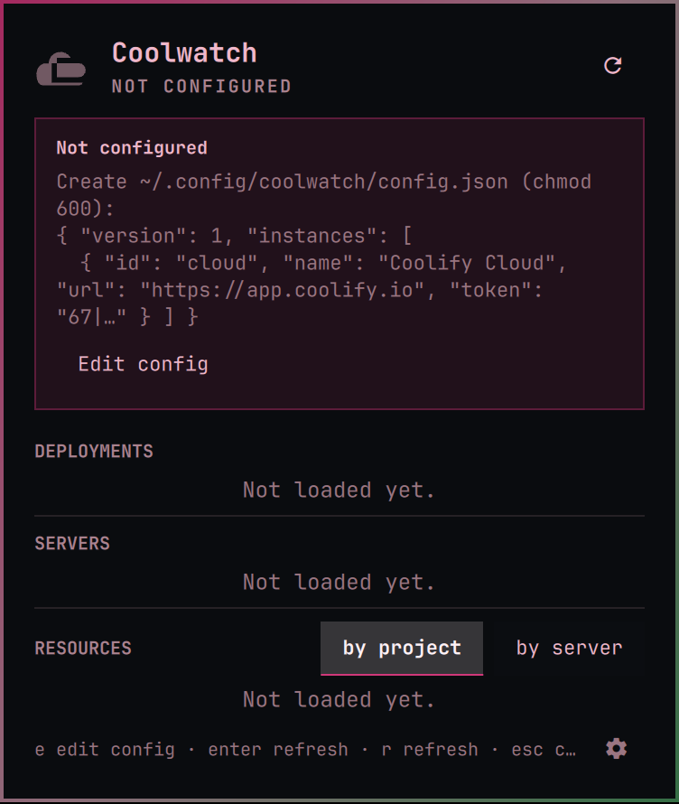
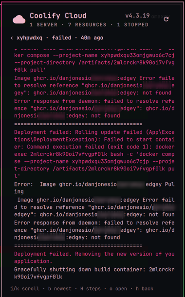

# Coolwatch

<p align="center">
  
</p>

Coolify in the Omarchy bar. One icon, one panel: your servers, applications, services and
databases with their live status, the deployments running and queued, and the buttons to
deploy, redeploy, restart, stop, start and cancel. Toasts when a build queues, finishes or
fails, when a resource stops, and when a server drops off. Build logs, container logs and
deployment history without leaving the panel. Works with Coolify Cloud and self-hosted
Coolify through the REST API, and with several Coolify instances at once.

It is a native [Omarchy](https://omarchy.org/) shell plugin: no daemon, no second process,
no SSH. Everything it shows comes from `GET /api/v1/…` with your token, and it stays well
under Coolify's rate limit by design.

<p align="center">
  
</p>

## Requirements

- Omarchy with `omarchy-shell` (the Quickshell bar; Omarchy 4.0 or newer).
- Coolify 4.3 or newer. Coolify Cloud has the API on; self-hosted must enable it under
  **Settings → Advanced → API Access**.
- An API token with `read`, `read:sensitive` and `deploy` (see [Token](#token)).

## Install

```sh
omarchy plugin add https://github.com/danjonesio/coolwatch.git --enable
```

Then click the cloud icon in the bar and press **Edit config** in the panel (the cog at
the bottom right, or `e`). That creates
`~/.config/coolwatch/config.json` (mode 0600 in a 0700 directory) with this shape and
opens it in your editor:

```json
{
  "version": 1,
  "_help": "One object per Coolify. Add a second one to instances for a self-hosted server, e.g. { ... }. Full reference: …",
  "instances": [
    { "id": "cloud", "name": "Coolify Cloud", "url": "https://app.coolify.io", "token": "paste-your-token-here" }
  ]
}
```

Replace the token, save, and the panel fills in on the next poll. No restart needed: the
file is watched. The `_help` line is ignored by the plugin; it shows the shape of a second
instance and links back to [Configuration](#configuration).

<p align="center">
  
</p>

### Token

Create it in Coolify under **Security → API Tokens** and tick:

| Ability | What it enables |
|---|---|
| `read` | everything the panel shows |
| `deploy` | Deploy, Redeploy, Restart, Stop, Start, Cancel, tag deploy |
| `read:sensitive` | build logs in the panel and the "click for the log" toast |
| `write` | optional; only **Validate server** |

Coolify cannot change a token's abilities afterwards: create a new one and swap it in.
Without `read:sensitive` everything still works except the build log view, which says so.

## What you see

**The bar icon** is a cloud. It glows while something deploys, turns into an alert after a
failed build until you open the panel, and shows a cloud-off while a server is
unreachable. Dimmed means Coolwatch itself has a problem (no config, bad token, offline,
rate limited) and the tooltip says which. Hover for the counts. Left click opens the
panel, middle click switches to the next Coolify instance, right click opens Coolify in
the browser.

**The panel** has four parts:

- **Hero**: the instance name, Coolify's version, and `N servers · N resources · N
  deploying · N stopped · N unhealthy`. With two or more instances a row of chips sits
  under it.
- **Deployments**: everything queued or building, then the recent ones with their branch
  and commit message. A finished or failed build stays until you dismiss it, so a failure
  overnight is still there in the morning.
- **Servers**: reachable or not, IP, resource count. A **Validate** button on each.
- **Resources**: every application, service and database, grouped **by project** or **by
  server** (the toggle in the header, or `g`), each with its health word and kind. Folds
  remember whether you closed them. A **Tags** fold appears when the team has tags.

Press `/` to type a filter: it narrows resources and deployments as you type, opens the
folds with a match and hides the rest. Esc clears it.

## What you can do

Click a row (or press Enter) to open its strip of buttons. Which ones appear depends on
the row:

| Row | Buttons |
|---|---|
| Application, running | Redeploy · Restart · Stop · More → Logs · History · Open |
| Application, stopped | Deploy · Start · History · Open |
| Service or database, running | Restart · Stop · Logs · Open |
| Service or database, stopped | Start · Open |
| Server | Validate · Open |
| Deployment, running or queued | Logs · Cancel · Open |
| Deployment, finished or failed | Logs · Dismiss · Open |
| Tag | Deploy |

**Stop**, **Cancel**, **Rebuild without cache** (`D`, keyboard only) and **tag deploy** ask
first. Everything else runs on the click. After an action the row says `deploying…`,
`stopping…` and so on until Coolify reports the change; Coolify refreshes statuses about
once a minute, so give it that long.

**Open** goes to that resource's page in Coolify. **Logs** on a deployment opens its build
log inside the panel: it follows the build while it runs, and on a failure the failing
step is right there in the panel. **Logs** on a running application or database shows the
last 200 lines of its container; on a service it first asks which container.
**History** lists an application's deployments ten at a time; Enter on one opens that
build's log.

<p align="center">
  
</p>

<!-- PLACEHOLDER: screenshot of an application row with its strip open (docs/images/strip.png) -->
<!-- PLACEHOLDER: screenshot of the filter field narrowing the list (docs/images/filter.png) -->

### Keyboard

The panel is keyboard first. `j`/`k` move, `h`/`l` fold and unfold or step through a
strip, Esc backs out one level at a time and finally closes the panel.

| Key | Action |
|---|---|
| `j` / `k` | move; `k` from the first row lands on the hero |
| `h` / `l` | previous / next instance on the hero; fold / unfold a group; step through a strip |
| Enter | open a strip, run the focused button, refresh from the hero |
| `d` | deploy a stopped application, redeploy a running one; deploy a tag |
| `D` | rebuild an application without cache (asks first) |
| `s` | stop or start, whichever applies (stop asks first) |
| `t` | restart |
| `v` | validate a server |
| `x` | cancel a running deployment (asks first); dismiss a finished one |
| `o` | open in Coolify |
| `L` | build log of a deployment; container log of a running resource |
| `g` | group by project / by server |
| `/` | filter |
| `r` | refresh now; in a log view, refetch |
| `e` | edit the config (when the panel says it needs fixing) |
| Esc | close the strip, the view, the filter, then the panel |

Inside a build log: `j`/`k` scroll (and stop following), `b` follows the newest line
again, `H` shows Coolify's internal steps, `o` opens the deployment in Coolify, `h` goes
back. Inside History: Enter on a row opens that build's log, `h` goes back with your place
kept.

### From the command line

```sh
omarchy-shell io.github.danjonesio.coolwatch deploy|restart|stop|start <uuid>   # -> "queued deploy <uuid>" or why not
omarchy-shell io.github.danjonesio.coolwatch log <deployment uuid>             # opens the panel on that build's log
omarchy-shell io.github.danjonesio.coolwatch instances                          # -> "cloud (active), homelab"
omarchy-shell io.github.danjonesio.coolwatch instance homelab                   # switch
omarchy-shell io.github.danjonesio.coolwatch refresh
omarchy-shell io.github.danjonesio.coolwatch status | jq                        # counts, timings, last action; never a token
omarchy-shell shell toggle io.github.danjonesio.coolwatch                       # open or close the panel
```

The verbs never ask for confirmation: typing the verb is the confirmation. `status | jq
.lastAction` shows the outcome. They act on the active instance, except `log`, which
finds the instance holding that deployment.

## Notifications

Toasts arrive through Omarchy's own notifications, so they respect Do Not Disturb and
land in history:

| When | Urgency |
|---|---|
| a deployment is queued, starts building, or is cancelled | low |
| a deployment finishes; an application restarts | normal |
| **a deployment fails** | **critical** |
| a resource stops or degrades; it recovers | normal / low |
| **a server becomes unreachable**; it comes back | **critical** / low |

Click a toast to open the deployment, resource or server in Coolify. A failed build's
toast opens the panel on its log instead, at the failing step.

Two things worth knowing. A critical toast (failed build, unreachable server) is shown
even under Do Not Disturb; it is sent under the sender name `omarchy-action`, the only one
the shell lets through, and is listed as that sender in history. And the first poll after
a start or a config change never notifies, so a shell restart does not replay the past.

Bursts are tamed: at most three resource toasts per poll plus one summary, at most twelve
non-critical per minute, and a stop caused by your own action in the last few minutes is
not announced. Critical toasts are never capped. With several instances every toast body
ends with the instance name.

## Configuration

`~/.config/coolwatch/config.json`, every key beyond `instances` optional:

```json
{
  "version": 1,
  "instances": [
    { "id": "cloud", "name": "Coolify Cloud", "url": "https://app.coolify.io", "token": "67|…" },
    { "id": "homelab", "name": "Homelab", "url": "http://10.0.0.5:8000",
      "tokenCommand": ["op", "read", "op://Private/Coolify Homelab/credential"] }
  ],
  "poll": { "deploymentsSec": 4, "resourcesSec": 60, "serversSec": 120, "topologySec": 600 },
  "notify": { "deploymentQueued": true, "deploymentStarted": true, "deploymentFinished": true,
              "deploymentFailed": true, "resourceStateChanged": true, "serverReachability": true }
}
```

- **`instances`**: one is the usual case. Each `id` is a short name of letters, digits,
  `-` and `_`, unique in the list. `name` is what the hero, the chips and the toasts
  show. `url` is the Coolify origin; `http://` works but the panel warns that the token
  crosses the network in the clear. With two or more instances, chips under the hero
  switch between them (`h`/`l` on the hero, a click, a middle click on the bar icon, or
  the `instance` verb); each polls on its own, the icon follows the one you are looking
  at, and its tooltip names another's trouble.
- **`token` or `tokenCommand`**: `tokenCommand` is an argv array whose trimmed stdout is
  the token, so the secret never sits on disk (a password manager's `read` command, for
  instance). It keeps the token off disk, not away from other plugins loaded into the same
  shell. When both are set, `tokenCommand` wins.
- **`poll`**: seconds between polls; those are the defaults. With every panel closed and
  nothing deploying the deployments poll idles at 8 s regardless; `deploymentsSec` applies
  while a panel is open, and a running build is polled every 2 s (slower as its log
  grows). That comes to about 11 requests a minute per instance idle, against Coolify's
  limit of 200, and a 429 backs off automatically.
- **`notify`**: every key defaults to `true`; `"notify": false` switches every toast off.
  A cancelled deployment rides `deploymentFinished`. Values are booleans, unquoted; a bad
  value keeps its default and the panel says so.

Edits apply live. Changing `notify` changes nothing else; changing an instance resets
that instance only.

The file must be mode 0600 and owned by you. Writable by others, and the plugin refuses
to read it; readable by others with an inline `token`, and it warns. **Edit config** in
the panel creates it correctly.

**State** lives in `~/.local/state/coolwatch/` (0700): `recent.json` (and
`recent-<id>.json` for further instances) with the last seven days of finished and
failed deployments, so the panel remembers them across a shell restart, and `ui.json`
with your grouping and folds per instance. They hold names, branches, commit messages
and the instance URL. Never the token.

## What it does not do

- **Show CPU, memory or disk.** The Coolify REST API does not expose them, and Coolwatch
  does not open SSH sessions to get them. If Coolify adds a metrics endpoint, it will be
  read like any other.
- **Push.** Coolify has no push channel that reaches a laptop; every toast comes from
  polling and diffing, which is why a change made elsewhere shows up within about 8 s.
- **Create, delete or edit** servers, projects, resources or environment variables. Read,
  deploy, lifecycle and validate only.
- **Run anything outside the shell.** No daemon, no helper process, no CLI wrapper.

## Security

The token goes to curl on stdin, never in argv, logs, the `status` output or a state
file. Any local process can drive the plugin through `omarchy-shell`, and any plugin
loaded into the same shell can read the service, so the machine is the trust boundary.
Omarchy's notification history keeps the newest toasts, with names, branches and commit
messages, in files readable by your user.

## Remove

```sh
omarchy plugin remove io.github.danjonesio.coolwatch
rm -r ~/.config/coolwatch ~/.local/state/coolwatch   # your config and state, if you want them gone too
```

`omarchy plugin remove` keeps a timestamped backup of the plugin directory beside it.

## Docs

- [Product brief](docs/product.md)
- [Architecture](docs/architecture.md)
- [Design](docs/design.md)
- [Roadmap](docs/roadmap.md)
- [Coolify API reference](docs/coolify-api.md)
- [Omarchy shell reference](docs/omarchy-shell-reference.md)

## License

MIT. See [LICENSE](LICENSE).
